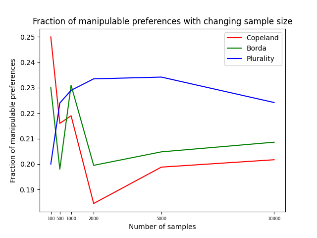
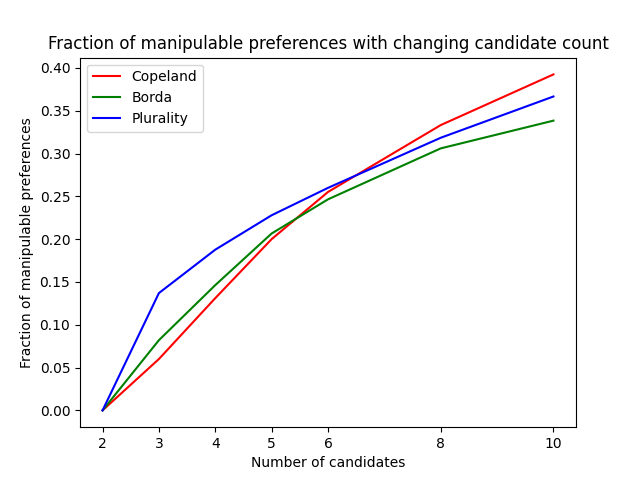
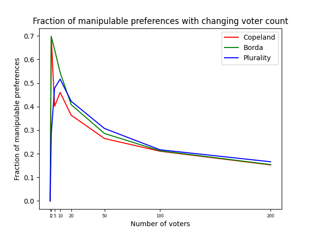

# Voting-Rules

## Hypothesis
1. For each of Copeland, Borda and Plurality, the winner is the candidate securing the highest score.
2. In Copeland, modifying the preferecne of a single voter, say `v`, might not necessarily lead to an increase in score of `v's` preferred candidate. For instance, consider an example where the head to head scores for every pair of candidates differ by at least 2 without considering the vote of`v`. In such a scenario, vote of `v` won't have any effect on the final scores of candidates.
3. In Borda and Plurality, on the other hand, the vote of `v` can increase the score of `v's` preferred candidates (other than `v's` most preferred candidate). Thus, the extent of manipulability appears higher in Borda and Plurality.
4. In Borda, there is a possibility to increase the maximum score of `v's` more preferred candidates (more preferred than original winner) and at the same time decrease the maximum score of `v's` lesser preferred candidates (original winner and lesser preferred candidates). However, in Plurality, the vote of `v` can only increase the maximum score of `v's` more preferred candidates. So, it appears that Borda in more manipulable than Plurality.

## Experimental Setup
### Experiments
1. Analyzing the convergence of fraction of manipulable preferences with changing sample size. We fixed the number of candidates to `5`, number of voters to `100` and varied the sample size as `[100, 500, 1000, 2000, 5000, 10000]`.
2. Analyzing the fraction of manipulable preferences with changing candidate count. We fixed the number of voters to `100` and number of samples to `5000` and varied the candidate count as `[2, 3, 4, 5, 6]`
3. Analyzing the fraction of manipulable preferences with changing voter count. We fixed the number of candidates to `5` and number of samples to `5000` and varied the voter count as `[1, 2, 5, 10, 20, 50, 100, 200]`

### Justifications
1. A setting of `5` candidates and `100` voters looks natural and at the same time is small enough to be efficiently computable for manipulability.
2. Based on the convergence plot, `5000` samples appears to be sweet spot for both high confidence of manipulable fractions as well as efficiency.

### Algorithm for checking manipulability
1. Greedy strategy for f-Manipulation, discussed in [lecture 14](https://rohitvaish.in/Teaching/2022-Fall/Slides/Lecture-14.pdf), is being used for checking manipulability.
2. If the original winner is `w`, then for each voter `v`, denote by `G(v, w)` the set of candidates which are more preferred than `w` by `v`. For each voter `v`, and each candidate `c` in `G(v, w)`, we check if `v` can manipulate its vote to make `c` win, using the greedy startegy.

## Experimental Results

## Inference
### Some rough points
1. `0` for `candidates = 2` and then increases almost linearly.
2. At `candidates = 6`, fraction becomes nearly equal for all the voting rules. Maybe beacuse of small sample.
2. `0` for `voters = 1` and then decreases exponentially.
3. For `voters = 2` equal for Copeland and Borda - explanation?

## TO-DO
- [ ] Add inferences
- [ ] Add more points in justification of `5` candidates and `100` voters?
- [ ] Detailed description of greedy strategy?
- [x] Add experimental results